<h1 align="center">
  AutoLogger UI
</h1>

<h4 align="center">
  Interface Web para Gestão de Histórico Veicular com Blockchain
</h4>

<p align="center">
  
  <a href="https://sonarcloud.io/summary/new_code?id=Pellegr1n1_autologger-ui">
    
  </a>
  <a href="https://sonarcloud.io/summary/new_code?id=Pellegr1n1_autologger-ui">
    
  </a>
  <a href="https://sonarcloud.io/summary/new_code?id=Pellegr1n1_autologger-ui">
    
  </a>
  <a href="https://sonarcloud.io/summary/new_code?id=Pellegr1n1_autologger-ui">
    
  </a>
</p>

<p align="center">
  <strong>Status:</strong> Em Produção | 
  <strong>Versão:</strong> 1.0.0 | 
  <strong>Aplicação:</strong> <a href="https://autologger.online">autologger.online</a>
</p>

---

## Sobre o Projeto

**AutoLogger UI** é uma aplicação web moderna desenvolvida em **React** e **TypeScript** para gerenciamento completo de histórico de manutenção de veículos. O frontend oferece uma interface intuitiva e responsiva para cadastro de veículos, registro de serviços, geração de relatórios e visualização de dados na blockchain.

### Contexto e Problema

Atualmente, o gerenciamento de histórico veicular enfrenta desafios na interface do usuário:
- **Falta de interface moderna**: Sistemas antigos e pouco intuitivos
- **Visualização limitada**: Dificuldade em visualizar histórico e estatísticas
- **Experiência fragmentada**: Múltiplas telas e processos confusos
- **Falta de responsividade**: Dificuldade de uso em dispositivos móveis
- **Design desatualizado**: Interfaces pouco atraentes e funcionais

### Solução

O AutoLogger UI oferece:
- **Interface Moderna** com React 19 e Ant Design 5
- **Design Responsivo** para todos os dispositivos
- **Visualizações Interativas** com gráficos e relatórios
- **Experiência Intuitiva** com navegação clara e fluxos otimizados
- **Integração Blockchain** para visualização de dados imutáveis

---

## Screenshots

### Página Inicial e Autenticação

#### Página Inicial

<p align="center">
  <strong>Desktop</strong><br/>
  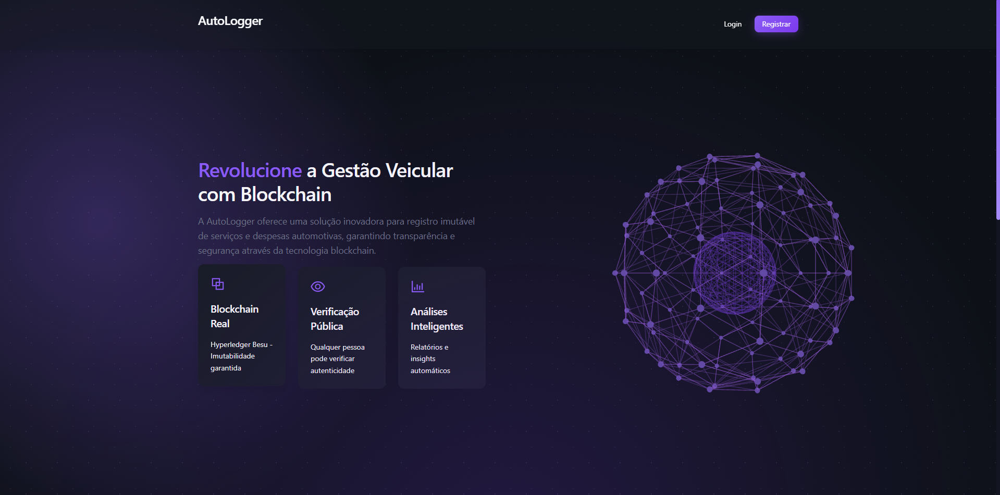
</p>

<p align="center">
  <strong>Mobile</strong><br/>
  
</p>

<p align="center"><em>Página inicial da aplicação com apresentação do sistema e funcionalidades principais</em></p>

#### Tela de Login

<p align="center">
  <strong>Desktop</strong><br/>
  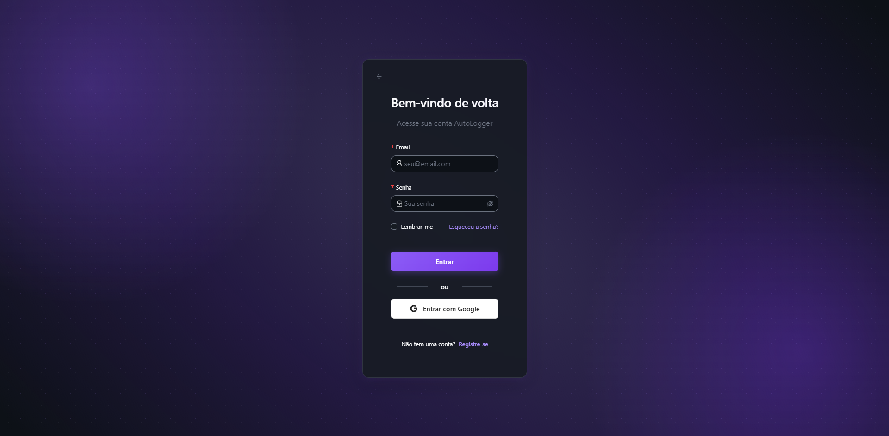
</p>

<p align="center">
  <strong>Mobile</strong><br/>
  
</p>

<p align="center"><em>Tela de login com opção de autenticação Google OAuth e acesso via email/senha</em></p>

#### Tela de Registro

<p align="center">
  <strong>Desktop</strong><br/>
  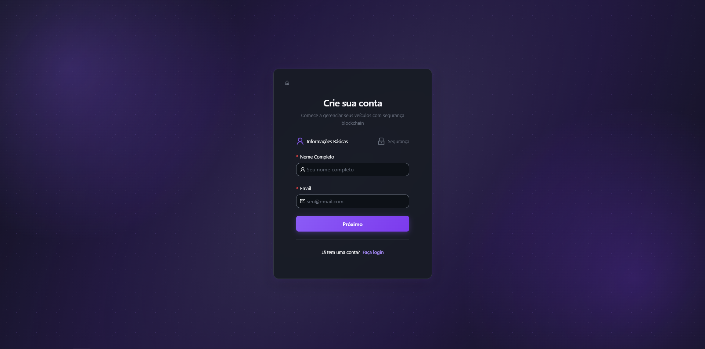
</p>

<p align="center">
  <strong>Mobile</strong><br/>
  
</p>

<p align="center"><em>Formulário de registro de novos usuários com validação de dados</em></p>

### Gestão de Veículos

#### Listagem de Veículos

<p align="center">
  <strong>Desktop</strong><br/>
  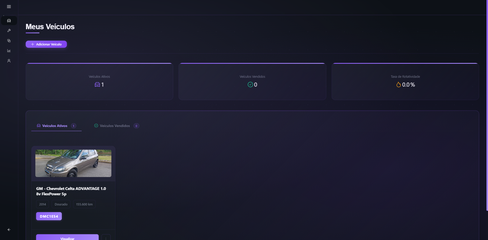
</p>

<p align="center">
  <strong>Mobile</strong><br/>
  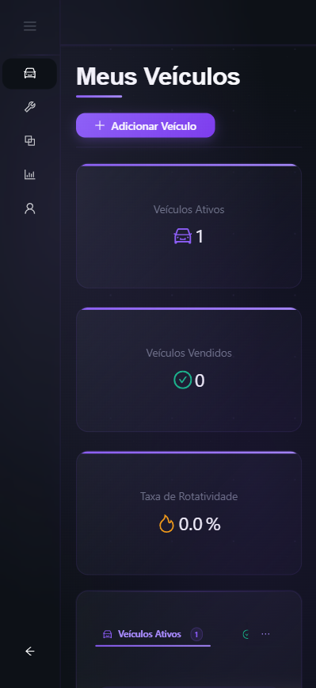
</p>

<p align="center"><em>Interface de gestão de veículos com listagem</em></p>

#### Serviços do Veículo

<p align="center">
  <strong>Desktop</strong><br/>
  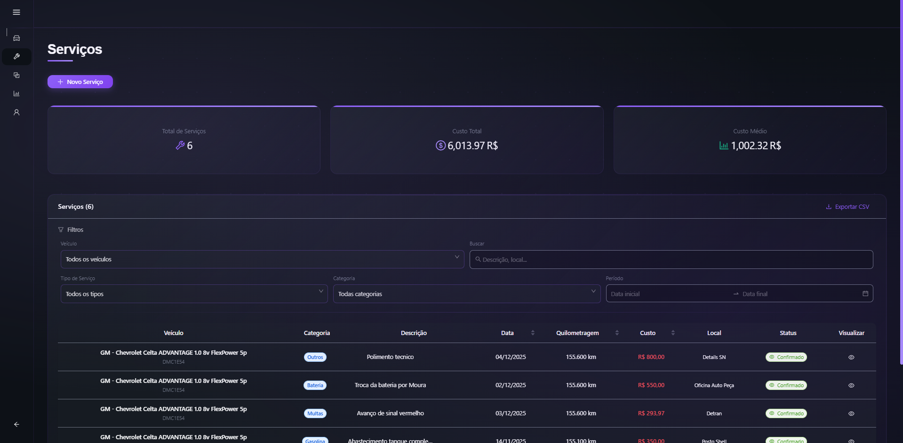
</p>

<p align="center">
  <strong>Mobile</strong><br/>
  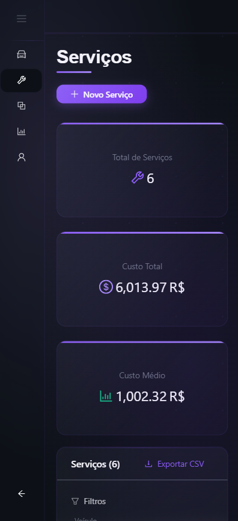
</p>

<p align="center"><em>Visualização de serviços e histórico de manutenção do veículo</em></p>

### Relatórios e Gráficos

<p align="center">
  <strong>Desktop</strong><br/>
  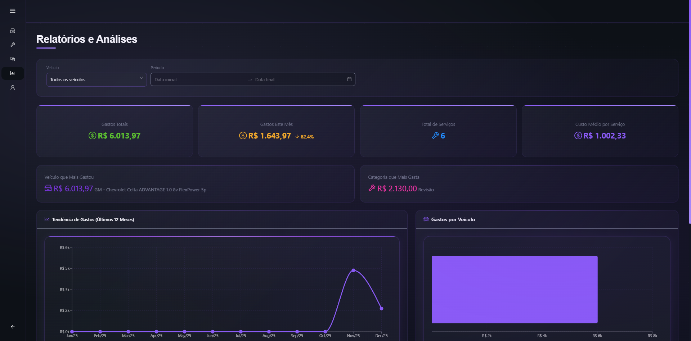
</p>

<p align="center">
  <strong>Mobile</strong><br/>
  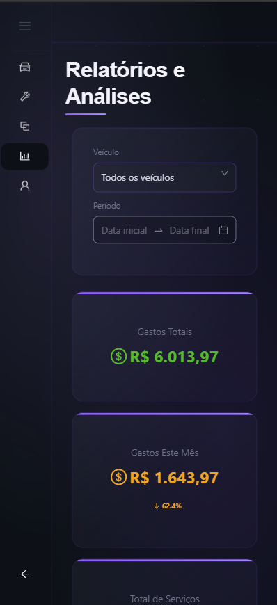
</p>

<p align="center"><em>Dashboard com gráficos de custos, estatísticas e análises de manutenção</em></p>

### Blockchain

<p align="center">
  <strong>Desktop</strong><br/>
  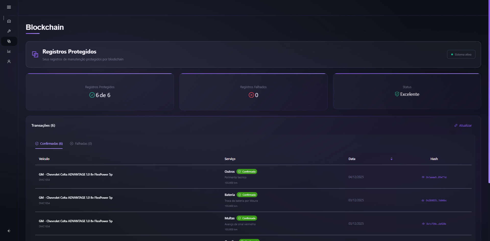
</p>

<p align="center">
  <strong>Mobile</strong><br/>
  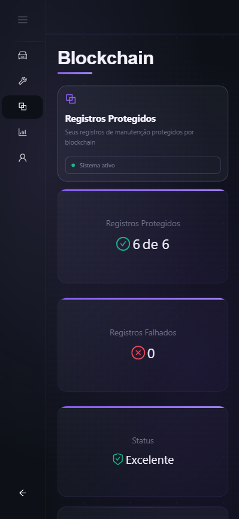
</p>

<p align="center"><em>Página de monitoramento da rede blockchain com status e histórico de transações</em></p>

### Perfil e Configurações

<p align="center">
  <strong>Desktop</strong><br/>
  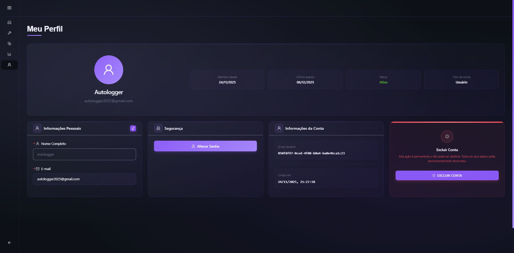
</p>

<p align="center">
  <strong>Mobile</strong><br/>
  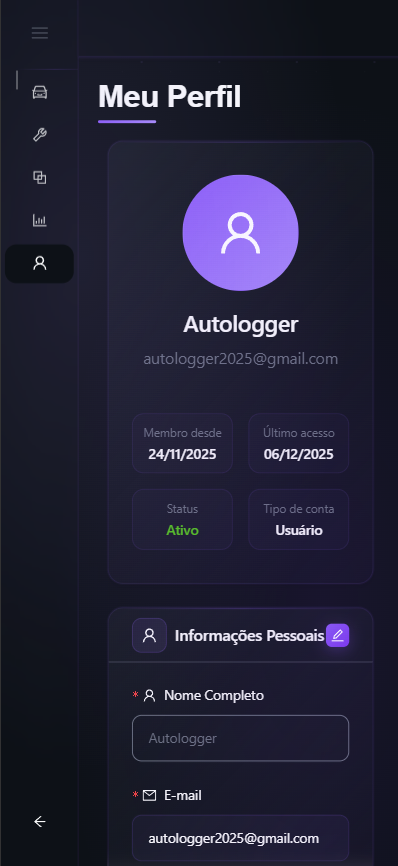
</p>

<p align="center"><em>Página de perfil com edição de dados pessoais e configurações da conta</em></p>

### Compartilhamento

<p align="center">
  <strong>Desktop</strong><br/>
  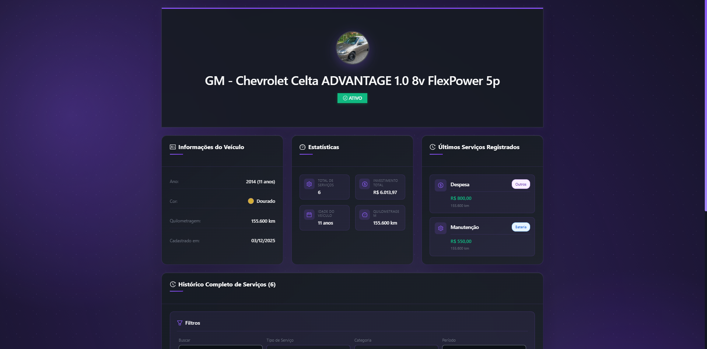
</p>

<p align="center">
  <strong>Mobile</strong><br/>
  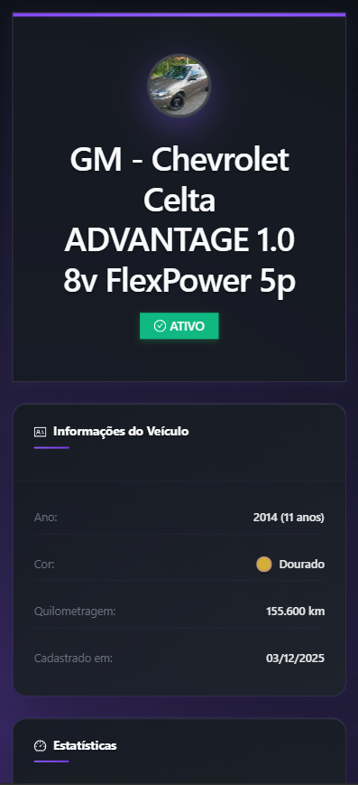
</p>

<p align="center"><em>Visualização pública de veículo compartilhado, acessível sem necessidade de login</em></p>


---

## Principais Funcionalidades

### Autenticação

- `Login com Email/Senha` Autenticação tradicional
- `Login com Google OAuth` Autenticação social rápida
- `Registro de Usuários` Cadastro completo de novos usuários
- `Recuperação de Senha` Reset de senha via email
- `Verificação de Email` Confirmação de conta
- `Gerenciamento de Sessão` Controle de autenticação

### Gestão de Veículos

- `Cadastro de Veículos` Registro completo com fotos
- `Listagem` Visualização de veículos
- `Edição` Atualização de veículos
- `Visualização Detalhada` Informações completas do veículo
- `Upload de Fotos` Múltiplas imagens por veículo
- `Marcação como Vendido` Controle de status

### Gestão de Serviços

- `Cadastro de Serviços` Registro detalhado de manutenção
- `Registro na Blockchain` Integração com blockchain
- `Histórico Completo` Visualização de todos os serviços
- `Upload de Anexos` Comprovantes e documentos
- `Filtros Avançados` Busca por período, tipo, etc.
- `Cálculo de Custos` Total de gastos por veículo

### Relatórios

- `Gráficos de Custos` Visualização de gastos ao longo do tempo
- `Estatísticas de Manutenção` Métricas e análises
- `Histórico por Período` Filtros temporais
- `Comparativos` Análise entre veículos

### Blockchain

- `Visualização de Status` Monitoramento da rede blockchain
- `Histórico de Transações` Listagem de transações
- `Verificação de Integridade` Validação de dados

### Perfil

- `Edição de Dados Pessoais` Atualização de informações
- `Alteração de Senha` Mudança de credenciais
- `Exclusão de Conta` Remoção segura de dados
- `Configurações` Preferências do usuário

### Compartilhamento

- `Consulta Pública` Visualização de veículos sem login
- `Geração de QR Code` Compartilhamento rápido
- `Links Temporários` Compartilhamento com expiração
- `Controle de Anexos` Opção de incluir/excluir documentos

---

## Tecnologias

### Frontend

| Tecnologia | Versão | Descrição |
|------------|--------|-----------|
|  | 19.0.0 | Biblioteca JavaScript para UI |
|  | 5.7.2 | Linguagem de programação |
|  | 6.3.1 | Build tool rápido |

### UI e Componentes

| Tecnologia | Versão | Descrição |
|------------|--------|-----------|
|  | 5.24.9 | Biblioteca de componentes React |
|  | 7.5.3 | Roteamento |
|  | 5.5.0 | Ícones |

### Visualizações

| Tecnologia | Versão | Descrição |
|------------|--------|-----------|
|  | 3.2.1 | Gráficos e visualizações |
|  | 2.6.1 | Componentes de gráficos |
|  | 0.176.0 | Visualizações 3D |

### Utilitários

| Tecnologia | Versão | Descrição |
|------------|--------|-----------|
|  | 1.5.4 | Geração de QR codes |
|  | 1.13.1 | Cliente HTTP |

### DevOps & Ferramentas

| Ferramenta | Descrição |
|------------|-----------|
|  | Containerização |
|  | Testes automatizados |
|  | Testes de componentes |
|  | Linter de código |
|  | Reverse Proxy |

---

## Arquitetura

### Padrões Arquiteturais

<p align="center">
  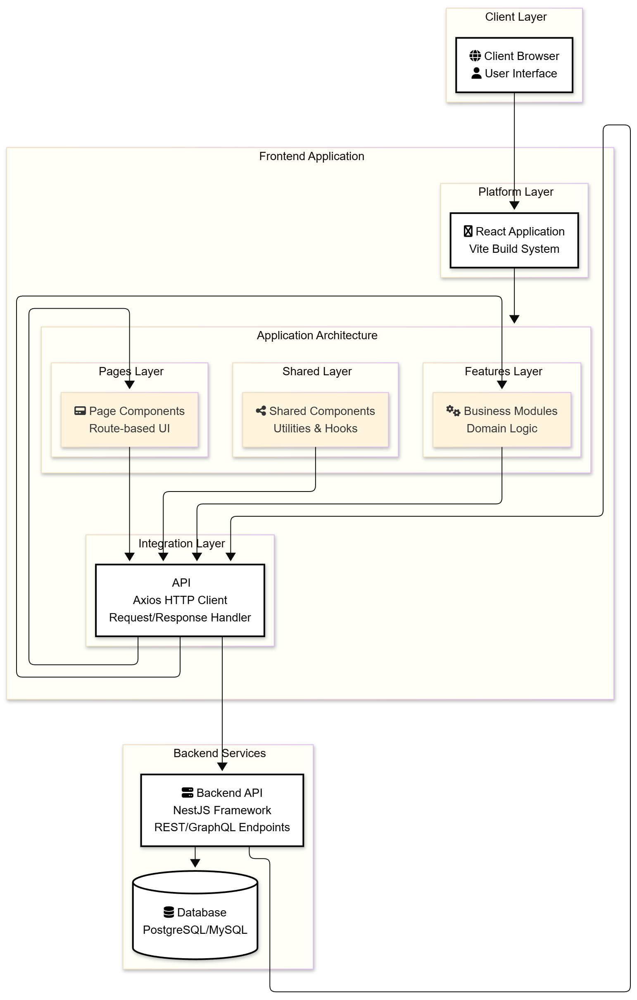
</p>

<p align="center"><em>Diagrama de arquitetura do frontend AutoLogger UI</em></p>

### Estrutura de Pastas

```
autologger-ui/
├── 📁 public/                 # Arquivos estáticos
│   └── assets/               # Imagens, ícones, etc
│
├── 📁 src/
│   ├── 📁 app/               # Configuração da aplicação
│   │   └── router/           # Configuração de rotas
│   │
│   ├── 📁 components/        # Componentes reutilizáveis
│   │   ├── layout/           # Header, Sider, Footer, etc
│   │   └── ui/               # Componentes UI genéricos
│   │
│   ├── 📁 features/          # Features organizadas por domínio
│   │   ├── auth/             # Autenticação e autorização
│   │   │   ├── components/   # Componentes específicos
│   │   │   ├── hooks/        # Hooks customizados
│   │   │   └── services/     # Serviços de autenticação
│   │   ├── blockchain/       # Integração blockchain
│   │   │   ├── components/   # Componentes blockchain
│   │   │   └── services/     # Serviços blockchain
│   │   └── vehicles/         # Gestão de veículos
│   │       ├── components/   # Componentes de veículos
│   │       └── services/    # Serviços de veículos
│   │
│   ├── 📁 pages/             # Páginas da aplicação
│   │   ├── Auth/             # Login, registro, recuperação
│   │   ├── Vehicles/         # Gestão de veículos
│   │   ├── Maintenance/      # Gestão de serviços
│   │   ├── Reports/          # Relatórios e gráficos
│   │   ├── Blockchain/       # Status e transações
│   │   ├── Profile/          # Perfil do usuário
│   │   ├── PublicVehicle/   # Consulta pública
│   │   ├── Home/             # Página inicial
│   │   ├── Privacy/          # Política de privacidade
│   │   └── Terms/            # Termos de uso
│   │
│   ├── 📁 shared/            # Código compartilhado
│   │   ├── api/              # Cliente API e configurações
│   │   ├── hooks/            # React hooks customizados
│   │   ├── services/         # Serviços compartilhados
│   │   ├── types/            # Tipos TypeScript
│   │   └── utils/            # Funções utilitárias
│   │
│   ├── 📁 styles/            # Estilos globais
│   │   └── globals.css       # CSS global
│   │
│   ├── App.tsx               # Componente raiz
│   └── main.tsx              # Ponto de entrada
│
├── 📁 docs/                  # Documentação
│   └── screenshots/          # Screenshots da aplicação
│
├── 📄 .env.example           # Exemplo de variáveis de ambiente
├── 📄 Dockerfile             # Configuração Docker
├── 📄 nginx.conf             # Configuração Nginx
├── 📄 package.json           # Dependências e scripts
├── 📄 tsconfig.json          # Configuração TypeScript
└── 📄 vite.config.ts         # Configuração Vite
```

### Organização por Features

A aplicação segue uma arquitetura modular baseada em features:

- **Features**: Organização por domínio de negócio (auth, vehicles, blockchain)
- **Pages**: Componentes de página completos
- **Components**: Componentes reutilizáveis
- **Shared**: Código compartilhado entre features

### Rotas Principais

- `/` - Página inicial
- `/auth/login` - Login
- `/auth/register` - Registro
- `/auth/forgot-password` - Recuperação de senha
- `/vehicles` - Listagem de veículos
- `/vehicles/new` - Cadastro de veículo
- `/vehicles/:id` - Detalhes do veículo
- `/maintenance` - Listagem de serviços
- `/maintenance/new` - Cadastro de serviço
- `/reports` - Relatórios e gráficos
- `/blockchain` - Status blockchain
- `/profile` - Perfil do usuário
- `/public/:token` - Consulta pública de veículo

---

## Como Executar

### Pré-requisitos

Antes de começar, você vai precisar ter instalado em sua máquina:
- [Git](https://git-scm.com)
- [Node.js](https://nodejs.org/en/) (v20.x ou superior)
- [npm](https://www.npmjs.com/) ou [yarn](https://yarnpkg.com/)

### Rodando a Aplicação (Modo Desenvolvimento)

```bash
# Clone este repositório
$ git clone https://github.com/user/autologger.git

# Acesse a pasta do projeto
$ cd autologger/autologger-ui

# Instale as dependências
$ npm install

# Copie o arquivo de variáveis de ambiente
$ cp .env.example .env

# Edite o arquivo .env com suas configurações
$ nano .env  # ou use seu editor favorito

# Inicie a aplicação em modo desenvolvimento
$ npm run dev

# A aplicação estará rodando em:
# Frontend: http://localhost:5173
```

### Rodando com Docker

```bash
# Build da imagem
$ docker build -t autologger-ui .

# Execute o container
$ docker run -p 5173:80 autologger-ui

# Ou use docker-compose
$ docker-compose up -d
```

### Configuração das Variáveis de Ambiente

Crie um arquivo `.env` na raiz do projeto com as seguintes variáveis:

```env
# API Backend
VITE_API_URL=http://localhost:3001/api

# Ambiente
VITE_APP_ENV=development

# Google OAuth (se necessário no frontend)
VITE_GOOGLE_CLIENT_ID=seu_google_client_id
```

### Scripts Disponíveis

```bash
# Desenvolvimento
npm run dev              # Inicia servidor de desenvolvimento
npm run build            # Build para produção
npm run preview          # Preview do build de produção

# Testes
npm test                 # Executa todos os testes
npm run test:watch       # Testes em modo watch
npm run test:coverage    # Cobertura de testes

# Qualidade
npm run lint             # Verifica código com ESLint
```

### Build de Produção

```bash
# Gerar build de produção
$ npm run build

# O build estará na pasta dist/
# Você pode servir com qualquer servidor estático:
$ npx serve dist
# ou
$ npx http-server dist
```

---

## Testes

### Executar Testes

```bash
# Todos os testes
npm test

# Testes em modo watch
npm run test:watch

# Cobertura de testes
npm run test:coverage
```

### Estrutura de Testes

```
src/
├── __tests__/           # Testes de componentes
│   └── **/*.test.tsx
└── **/*.spec.ts         # Testes unitários
```

### Ferramentas de Teste

- **Jest**: Framework de testes
- **React Testing Library**: Testes de componentes React
- **@testing-library/user-event**: Simulação de interações do usuário

---

## Segurança

### Implementações de Segurança

- **HTTPS/SSL** em produção
- **Tokens JWT** armazenados em cookies httpOnly
- **Validação de Dados** no frontend e backend
- **Proteção CSRF** via tokens
- **Sanitização de Inputs** para prevenir XSS
- **Rotas Protegidas** com guards de autenticação
- **CORS** configurado adequadamente
- **Variáveis de Ambiente** para configurações sensíveis

---

## Design e UX

### Design System

- **Ant Design 5**: Componentes consistentes e acessíveis
- **Tema Customizado**: Cores e estilos personalizados
- **Responsividade**: Mobile-first approach
- **Acessibilidade**: Suporte a leitores de tela

### Componentes Principais

- **Layout**: Header, Sider, Footer
- **Forms**: Inputs, Selects, DatePickers
- **Tables**: Tabelas com paginação e filtros
- **Charts**: Gráficos interativos
- **Modals**: Diálogos e confirmações
- **Cards**: Cards informativos

---

## Deploy

### Ambiente de Produção

- **Hospedagem**: AWS
- **Build**: `npm run build`
- **Servidor**: Nginx para servir arquivos estáticos
- **HTTPS**: Certificado SSL configurado